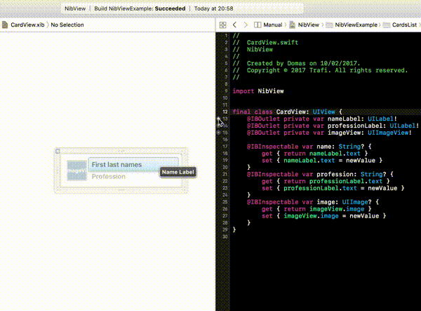

[](https://github.com/Carthage/Carthage)

# NibView
```swift
@IBDesignable class MyView: NibView {} // That's it! ✨
```


Tiny Swift framework to reference nibs from anywhere - code, other nibs or storyboards :sparkles:

|       | **Capabilities** |
| --- | --------------- |
| ✨ | **True** rendering inside interface builder with `@IBDesignable` and `@IBInspectable` |
| 📏 | Calculates correct intrinsic content size |
| ♻️ | Referencing from other nibs and storyboards - keeping them small |
| ⌨️ | Loading from code with a simple `.fromNib()`  |
| ⚙️ | Integrates as little or as much  |


Play around with [`Example` project](Example) 🕹️👈

# Usage

## Subclass `NibView`
Just subclass `NibView` and optionally add `@IBDesignable` attribute. That's it! ✨
```swift
@IBDesignable class MyView: NibView {}
```


<details>
<summary>⚠️  Usage If subclassing is <b>not an option</b>.</summary>

## Implement `NibLoadable`
Implementing `NibLoadable` protocol and overriding a couple of functions will unleash the full power of referencing 💪:neckbeard:

### ⌨️ - Code
To reference nibs only from code implement `NibLoadable` protocol:
```swift
class MyView: SomeBaseView, NibLoadable {
    // 'nibName' defaults to class name. "MyView" in this case.
    class var nibName: String { return "MyCustomView" }
}
let myView = MyView.fromNib()
```
### 💻 - IB
To reference nibs from interface builder (other nibs or storyboards) in addition to implementing `NibLoadable` override `awakeAfter(using:)` with a call to `nibLoader` - a helper struct from 'NibLoadable' protocol:
```swift
class MyView: SomeBaseView, NibLoadable {
    override func awakeAfter(using aDecoder: NSCoder) -> Any? {
        return nibLoader.awakeAfter(using: aDecoder, super.awakeAfter(using: aDecoder))
    }
}
```
### ⚡️📱✨ - `@IBDesignable`
To get real rendering and intrinsic content size from the nib - `@IBDesignable` attribute and some overrides are needed:
```swift
@IBDesignable
class MyView: SomeBaseView, NibLoadable {
    
    open override func awakeAfter(using aDecoder: NSCoder) -> Any? {
        return nibLoader.awakeAfter(using: aDecoder, super.awakeAfter(using: aDecoder))
    }
    
    #if TARGET_INTERFACE_BUILDER
    
    override init(frame: CGRect) {
        super.init(frame: frame)
        nibLoader.initWithFrame()
    }
    
    required init?(coder aDecoder: NSCoder) {
        super.init(coder: aDecoder)
    }
    
    override func prepareForInterfaceBuilder() {
        super.prepareForInterfaceBuilder()
        nibLoader.prepareForInterfaceBuilder()
    }

    override func setValue(_ value: Any?, forKeyPath keyPath: String) {
        super.setValue(value, forKeyPath: keyPath)
        nibLoader.setValue(value, forKeyPath: keyPath)
    }
    
    #endif
}
```
</details>

# Installation
## [Carthage](https://github.com/Carthage/Carthage#adding-frameworks-to-an-application)
Add the following line to your Cartfile:
```
github "Trafi/NibView"
```
## Manual
Drag the [`Sources`](Sources) folder into your Xcode project.